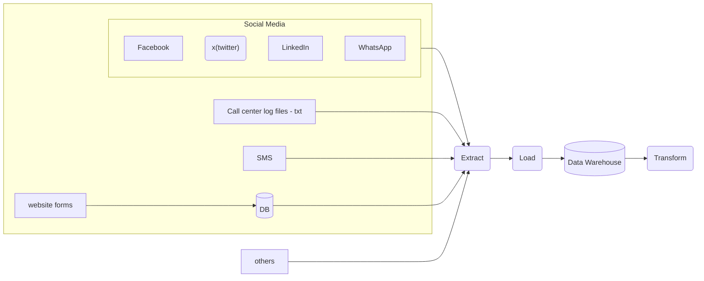

# Data Engineering Fundamentals 

[//]: # (Add diagram of conceptual pipeline here. Use mermaid.js)

[//]: # (Written explanation)
[//]: # (Design choices)

It is fundamental to understand the profile and needs of the customers of Beejan Technologies.
What kind of downtime would the customers be able to tolerate?
What critical operations and businesses rely on Beejan Technologies?
Does the company have a SLA with their customers?

Assuming that the customers are located within one time-zone and that the majority of clients actively use the services between 6am and 12am, it can be beneficial to ingest data more frequently during this time-frame.
For this use case it is enough to ingest and process data in hourly batches -- even real time data from social media.

### 1. Data Sources

- Due to the company's profile, I assume that the most relevant social media platforms are Facebook, X(Twitter), LinkedIn and WhatsApp and that data about customer issues is ingested as JSON data through the respective official APIs.
- Call center data is provided as text log files.
- SMS (?)
- I assume that website forms data is stored in a SQL database.
- ... possibly other data sources

### 2. Ingestion Strategy

- Social media: API ingestion.
- Call center log files: file upload.
- Website forms data: SQL query.

### 3. Processing/Transformation

- In order to keep the pipeline flexible, I decide for the ELT design. Nevertheless, it is important to understand which relevant fields the data must contain:
  - complaint timestamp
  - client location
  - client-id
  - involved employees (call center, 1st level support, ...)
  - complaint category
  - complaint status (open, in-process, resolved)
  - full text / link to raw data

### 4. Storage Options

- The data will be stored in a data wharehouse. A data lake is not necessary, since it is better suited for big data analytics and machine learning applications, which are out of the scope of the current project.
- The cleaned data can be stored in the parquet format for fast querying capabilities.

### 5. Serving

- How will the data be queried?
  - Example of possible queries:
    - Count number of complaints of a certain category, grouped by date and geographic zone.
    - Calculate average, median, or other statistics of the time it takes until an issue is solved.
  - A well-documented API should be provided to Data Scientists and Data Analysts to access the data.
  - Managers and other stakeholders can vizualize the data through Dashboards built by the Analytics team.
 
### 6. Orchestration e Monitoring

The pipeline will run hourly. A pipeline monitoring system will alert the Data Engineering team through e-mail and/or a phone notification.

### 7. DataOps

A thorough cost comparison must be performed. If the current infrastrocture allows it, the pipeline can run on-premises, otherwise, a cloud provider must be sought.
CI/CD principles. Good DevOps practices. VCS. dev -> main (qual) -> prod (release-*.*.*).

[//]: # (Assumptions/thought process)
[//]: # (Challenges or unknowns)
[//]: # (other information)
